<p align="right">
   <a href="./README.md">EN</a> | <a href="./README.zh-CN.md">简</a> | <a href="./README.zh-TW.md">繁</a> | <strong>KO</strong> | <a href="./README.ja.md">JA</a>
</p>
<div align="center">
    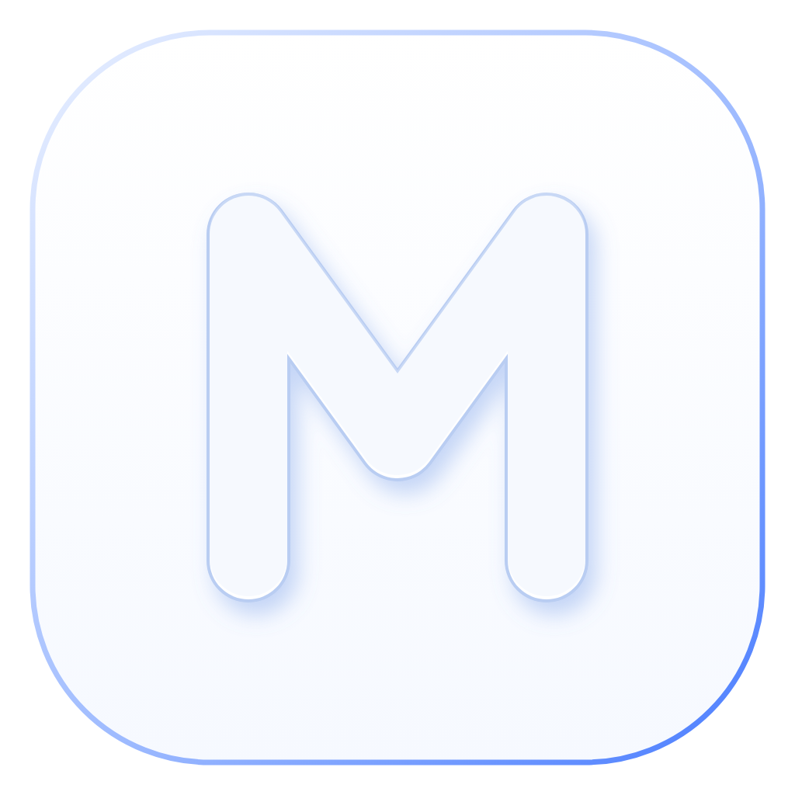
    <h1>Mini Token Monitor</h1>
</div>

<p align="center">
    <em>모든 AI 코딩 도구의 실시간 사용량과 남은 한도를 모아 보여주는 미니 버전.</em>
</p>

<div align="center">
    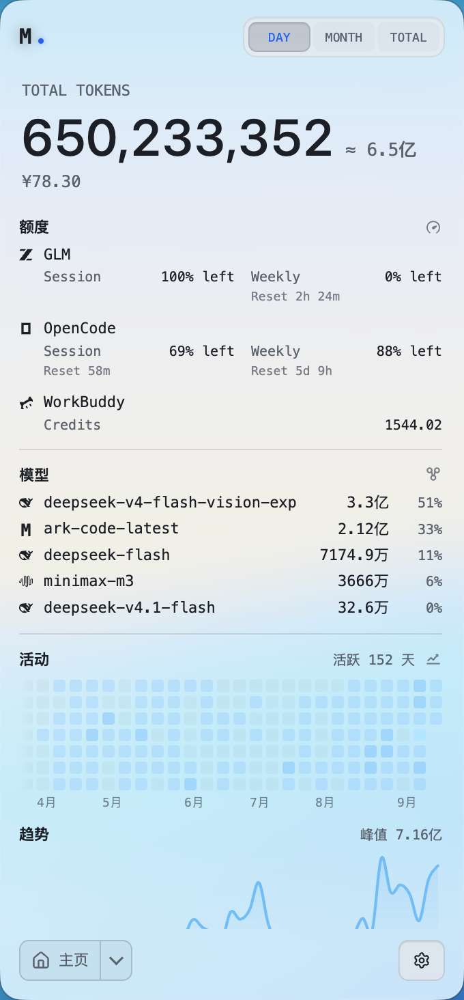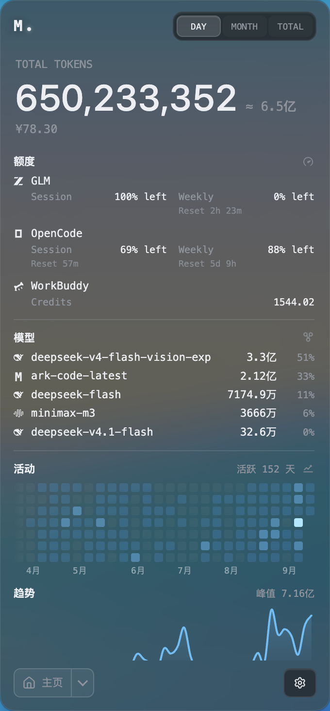
</div>

## Mini Token Monitor란?

Claude Code, Codex, Cursor, GitHub Copilot, Cherry Studio 등 36개 이상의 AI 코딩 도구의 토큰 사용량과 AI 도구 한도를 실시간으로 보여주는 메뉴 막대 위젯입니다. 실시간 추세를 지원하며 도구·모델·세션·프로젝트별 분류도 확인할 수 있습니다.

## 지원 도구

Mini Token Monitor는 토큰 사용량, 계정 한도, 세션 상세를 각각 별도로 지원합니다:

| Logo | 도구 | 데이터 경로 | 토큰 사용량 | AI 도구 한도 | 세션 상세 |
|:---:|------|-----------|:---:|:---:|:---:|
|  | Claude Code | `~/.claude/projects/`, `~/.claude/transcripts/` | ✅ | ✅ | ✅ |
| 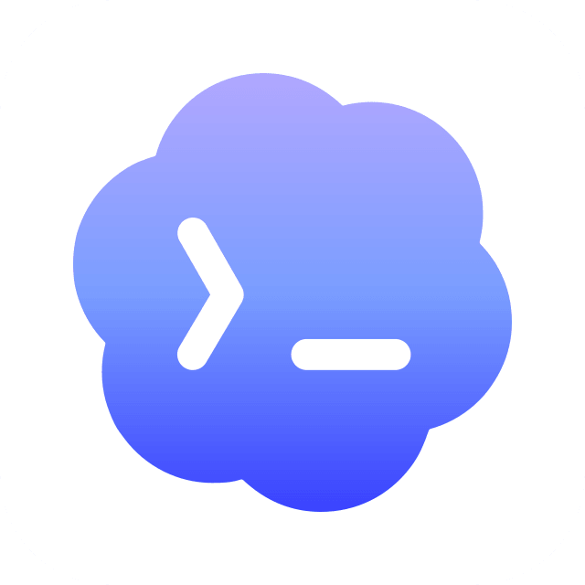 | Codex | `~/.codex/`(`sessions/`, `archived_sessions/`) | ✅ | ✅ | ✅ |
| 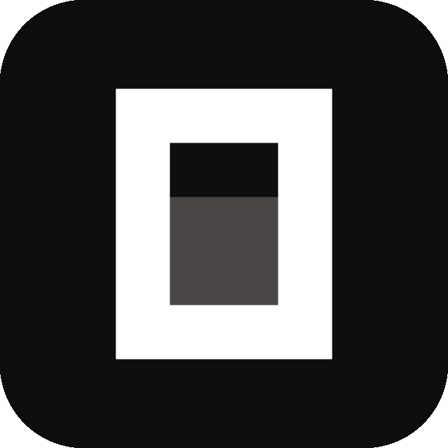 | OpenCode | `~/.local/share/opencode/`(`opencode*.db`, `storage/message/`) | ✅ | ✅ | ✅ |
|  | Hermes Agent | `~/.hermes/state.db` | ✅ | — | — |
| 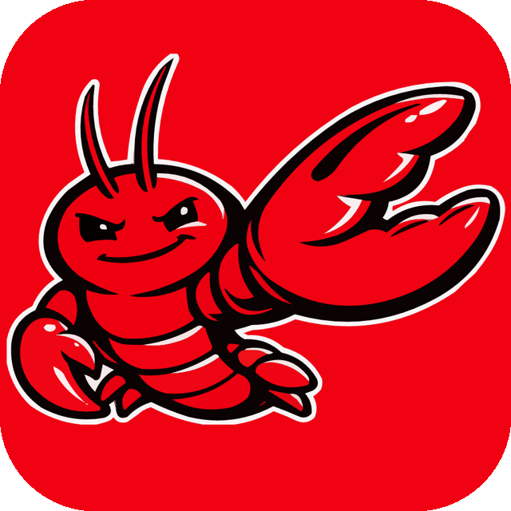 | OpenClaw | `~/.openclaw/agents/` | ✅ | — | — |
|  | Cursor IDE / Cursor CLI | `~/.config/tokscale/cursor-cache/`(계정 단위 사용량 내보내기) | ✅ | ✅ | — |
|  | Antigravity | `~/.gemini/`(`antigravity/`, `antigravity-ide/`, `antigravity-backup/`, `antigravity-cli/conversations/`) | ✅ | ✅ | — |
|  | Cline | VS Code globalStorage tasks(`.../saoudrizwan.claude-dev/tasks/`), `~/.cline/data/sessions/` | ✅ | — | — |
| 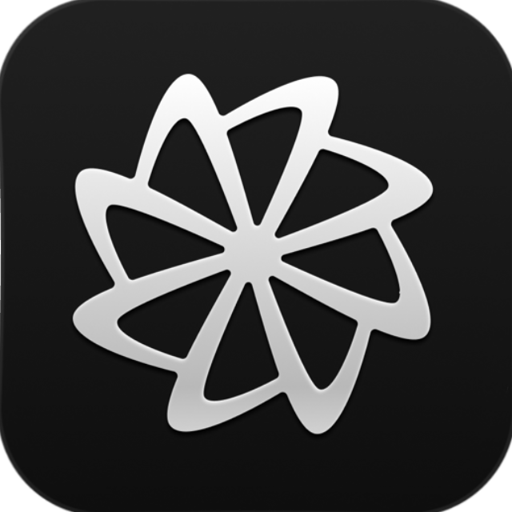 | Factory Droid | `~/.factory/sessions/` | ✅ | — | — |
|  | Kimi CLI / Kimi Code / Kimi Work | `~/.kimi/sessions/`, `~/.kimi-code/sessions/`, `<platform-app-data>/kimi-desktop/` | ✅ | ✅ | — |
|  | Qwen CLI | `~/.qwen/projects/` | ✅ | — | — |
|  | Grok Build | `~/.grok/`(`sessions/`, `logs/unified.jsonl`) | ✅ | ✅ | — |
|  | GitHub Copilot | VS Code `workspaceStorage/*/chatSessions/`, `~/.copilot/`(`otel/`, `data.db`) | ✅ | ✅ | — |
|  | Pi / Oh My Pi | `~/.pi/agent/sessions/`, `~/.omp/agent/sessions/` | ✅ | — | — |
|  | Zed | `~/.local/share/zed/threads/threads.db` | ✅ | ✅ | — |
|  | Kilo | `~/.local/share/kilo/kilo.db`; VS Code globalStorage tasks(`.../kilocode.kilo-code/tasks/`) — 확장 로그는 Linux와 원격/WSL 전용 | ✅ | — | — |
|  | Command Code | `~/.commandcode/projects/**/*.jsonl` | ✅ | ✅ | — |
| 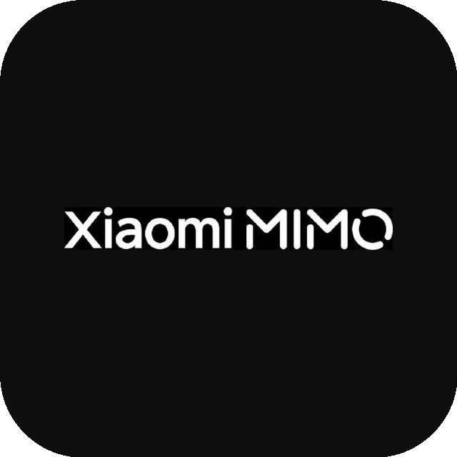 | MiMo Code | `~/.local/share/mimocode/mimocode.db` | ✅ | ✅ | — |
|  | ZCode / GLM | `~/.zcode/`(`projects/`, `cli/db/db.sqlite`) | ✅ | ✅ | — |
|  | Kiro | `~/.kiro/sessions/cli/`, Kiro IDE globalStorage와 `kiro-cli` DB | ✅ | ✅ | — |
|  | CodeBuddy | `~/.codebuddy/projects/` + IDE / VS Code 확장 로그 | ✅ | — | — |
|  | WorkBuddy | `~/.workbuddy/projects/`, `~/.workbuddy/workbuddy.db` | ✅ | ✅ | — |
|  | Proma | `~/.proma/agent-sessions/*.jsonl` | ✅ | — | — |
|  | Qoder | `<platform-app-data>/QoderCN/SharedClientCache/cache/db/local.db`(중국판 전용) | ✅ | ✅ | — |
|  | Reasonix | `~/.reasonix/`(`stats/`, `sessions/`, `projects/*/sessions/`) | ✅ | — | — |
|  | DeepSeek / DeepSeek Harness | `~/.dsh/sessions/`(`session.jsonl`, `session.jsonl.zstd`) | ✅ | ✅ | ✅ |
| 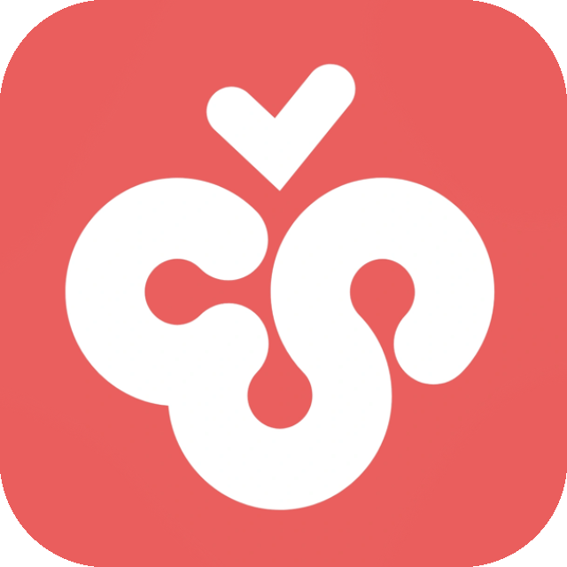 | Cherry Studio | `<platform-app-data>/CherryStudio/`(`Data/Agents/.claude/projects/` V2, `.claude/projects/` legacy) | ✅ | — | — |
|  | LM Studio | `~/.lmstudio/server-logs/**/*.log` | ✅ | — | — |
| 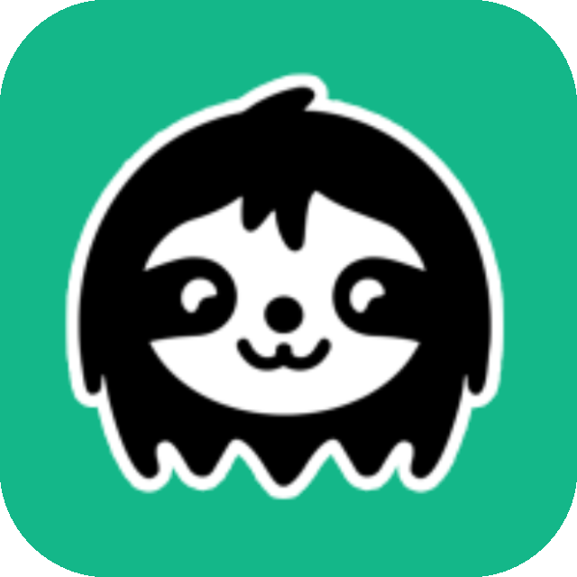 | Unsloth Studio | `~/.unsloth/studio/studio.db` | ✅ | — | — |
|  | OpenRouter | OpenRouter API 키(사용량/키 한도 조회, credits 접근이 허용되면 잔액 표시, 공식 문서는 Management 키 지정) | — | ✅ | — |
| 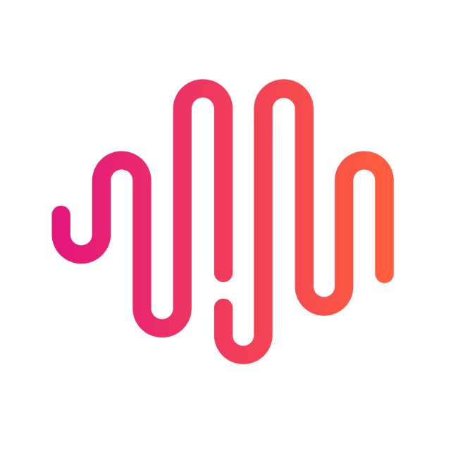 | Minimax | Minimax API 키(Minimax API로 Token Plan 할당량 조회) | — | ✅ | — |
| 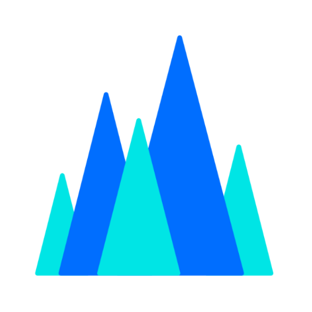 | Volcengine | Ark API key 또는 Volcengine AK/SK(Volcengine API로 Ark Coding Plan / Agent Plan 할당량 조회) | — | ✅ | — |
|  | Ollama | Ollama Cloud cookie(ollama.com/settings로 session/주간 사용량 조회) | — | ✅ | — |
| 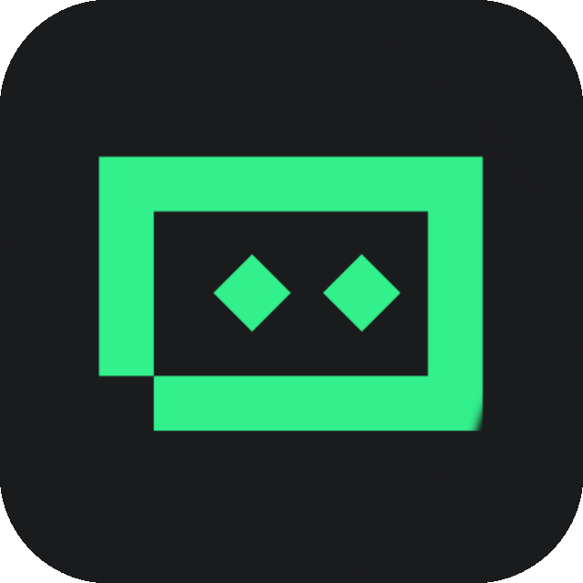 | Trae CN | Trae CN access token(trae.cn으로 Trae CN/SOLO credits 조회) | — | ✅ | — |
| 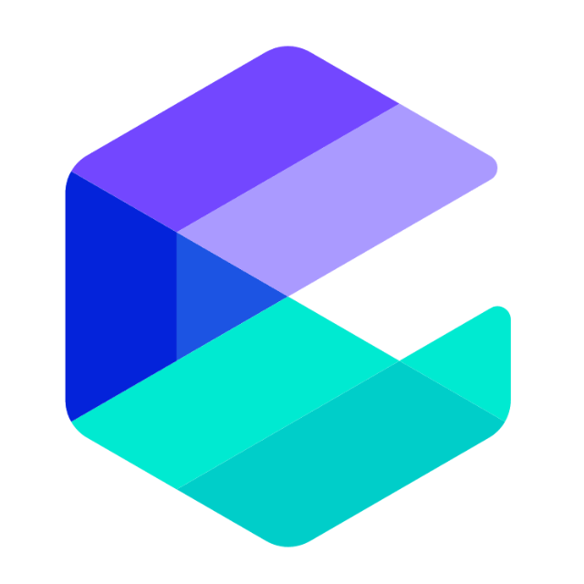 | Alibaba Cloud | Alibaba Cloud 콘솔 cookie(Bailian/Model Studio Token Plan 할당량, 팀·개인) | — | ✅ | — |
| 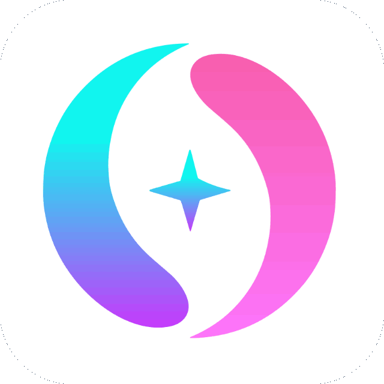 | 서드파티 API | New API / Sub2API 호환 계정 프리셋(호환 One API 포크 포함), New API API 키 프리셋, Custom 잔액 엔드포인트 | — | ✅ | — |

<details>
<summary><strong>주의사항, Custom 잔액 엔드포인트, 환경 변수로 덮어쓰는 데이터 경로</strong></summary>

<br>

- 위 표는 기본 경로입니다. Mini Token Monitor는 Tokscale과 동일한 환경 변수 덮어쓰기를 따릅니다. `~/.local/share/` 하위 경로는 `$XDG_DATA_HOME`, 도구별로는 `$CODEX_HOME`, `$GROK_HOME`, `$HERMES_HOME`, `$KIMI_CODE_HOME`, `$UNSLOTH_STUDIO_HOME`, `$LM_STUDIO_HOME`, `$DSH_HOME`, `$REASONIX_STATE_HOME`, `$REASONIX_HOME`, 그리고 `$CLINE_*` 계열입니다.
- LM Studio 추적은 현재 서버 로그에 기록된 OpenAI 호환 `/v1/chat/completions`와 `/v1/responses` 요청만 포함합니다. LM Studio 내장 Chat UI에서 시작한 대화와 네이티브 `/api/v1/chat` 요청은 포함되지 않습니다.
- Unsloth Studio는 `studio.db`에서 Studio 채팅과 로컬 API의 추론 사용량을 추적합니다. 로컬 추론의 API 비용은 0이며, 식별 가능한 종량제 공급자는 Tokscale의 가격 추정을 사용합니다. 학습 토큰은 포함되지 않습니다. 자세한 내용은 [Unsloth 데이터 소스 안내](docs/providers/unsloth.md)를 참고하세요.

- Command Code transcript에는 실제 토큰 수나 메시지별 모델 정보가 없습니다. 토큰 사용량은 transcript 텍스트에서 추정하며, 모델 귀속과 산출 비용은 각 요청 당시 실제 사용된 모델이 아니라 현재 구성된 모델을 반영할 수 있습니다.
- Cursor 캐시는 Cursor의 계정 단위 사용량 내보내기에서 오므로 Cursor IDE와 Cursor CLI를 모두 포함합니다. Mini Token Monitor는 Cursor 데스크톱 앱에서 로그인한 계정을 자동 감지하며 설정에서 수동으로 추가할 수도 있습니다. 캐시가 오래되면 자동으로 다시 동기화되지만, 방금 끝난 세션이 Cursor 대시보드에 반영되기까지 몇 분 걸릴 수 있어 사용량은 동기화 시점에 갱신되며 즉시 반영되지는 않습니다.

- Custom은 하나의 GET 잔액 엔드포인트에서 숫자 JSON 필드를 매핑합니다. OpenAI 또는 Anthropic API 호환성만으로는 충분하지 않습니다.

#### Qoder CN(로컬 어댑터)

Qoder CN의 토큰 사용량은 API가 아니라 앱의 로컬 SQLite 데이터베이스에서 읽습니다 —— 설정 → tools에서 활성화합니다(옵트인, 기본 꺼짐). 데이터베이스는 플랫폼별로 자동 감지됩니다: macOS `~/Library/Application Support/QoderCN/SharedClientCache/cache/db/local.db`, Windows `%APPDATA%\QoderCN\SharedClientCache\cache\db\local.db`, Linux `~/.config/QoderCN/SharedClientCache/cache/db/local.db` —— `TOKEN_MONITOR_QODER_CN_DB_PATH`로 덮어쓸 수 있습니다.

고급 로컬 통합입니다: 읽기에는 PATH의 `sqlite3` CLI 또는 flag 없이 `node:sqlite`를 쓸 수 있는 Node 런타임이 필요합니다(Node ≥ 23.4; Electron 위젯은 CLI가 필요할 수 있음). 읽기 실패는 로그에 기록되며, 완전한 스냅샷이 이미 있으면 0 사용량으로 덮어쓰지 않고 유지합니다. 비용은 매핑된 각 모델에 대해 models.dev 카탈로그 가격으로 추정합니다. Qoder가 데이터베이스 스키마를 바꾸면 어댑터가 작동하지 않을 수 있습니다.
</details>

## Mini Token Monitor를 쓰는 이유

대부분의 사용량 모니터는 실행 중인 그 기기에서만 유용합니다. Mini Token Monitor는 local-first입니다. 위젯이 이 기기의 로그를 직접 읽어 수 초 내에 토큰 변화를 보여주며 서버가 필요 없습니다. Token Monitor를 간소화한 에디션으로 메뉴 막대 항목이 하나뿐입니다. 선택적인 `npm run agent`는 직접 운영하는 hub로 사용량을 보고할 수 있습니다.

## 기능

### 사용량 추적

- **실시간 토큰 추적** — Claude Code, Codex, Cursor, GitHub Copilot, Antigravity, OpenCode 등 29개 이상의 AI 도구, 턴당 수 초 내 UI 갱신 (전체 목록은 위 표 참고)
- **실시간 토큰 속도** — 생성 속도를 `tok/s`로, 총 소모를 `tok/min`으로 보여주는 선택형 실시간 표시
- **세션별 상세** — 세션을 열면 프롬프트별 토큰, 응답별 토큰 분할·사용 도구까지 확장 (로컬 transcript/DB를 필요할 때만 읽으며 동기화하지 않음)
- **캐시 히트 통계** — 도구·모델 클릭 시 입력 토큰(캐시 hit/miss), 출력 토큰, 히트율 상세
- **비용과 통화** — 토큰 수와 함께 비용 표시. USD, TWD, HKD, CNY 지원, 환율은 매일 자동 갱신, 설정에서 수동 덮어쓰기 가능
- **사용자 지정 스캔 경로** — 세션이 기본 위치에 없을 때 도구별로 추가 폴더를 지정할 수 있습니다
- **WSL 사용량 (Windows)** — 실행 중인 WSL 배포판의 파일 기반 사용량을 약 5분마다 자동 감지해 합산합니다. OpenCode와 Hermes 같은 SQLite 기반 도구는 [WSL 내부 헤드리스 에이전트](docs/wsl-sqlite-setup.md)가 필요할 수 있습니다

### 한도·추세·내보내기

- **AI 도구 한도 감지** — Claude Code, Codex, Cursor, OpenRouter, 서드파티 API, GLM, Kimi 등 23개 이상 공급자의 session/daily/weekly/billing/credits, 여러 OpenRouter/서드파티 프로필, 잔액형 계정(Claude 크레딧, DeepSeek 선불 잔액과 사용 내역, 서드파티 잔액)
- **여러 계정과 Codex 전환** — 한 공급자에서 여러 계정을 추적하고 각각의 한도를 표시. 추적 중인 Codex 계정은 재인증 없이 로컬 계정으로 한 번에 전환 가능
- **Codex 초기화 예측** — 선택적으로 켜는 서드파티 초기화 예측. 예상 초기화 시각, 초기화 유형(Regular 또는 Banked), 마지막 초기화 시각을 표시
- **삭제된 세션 사용량 유지** — 많은 도구가 오래된 세션을 정리합니다(Claude Code는 기본적으로 30일 후 트랜스크립트 삭제). 켜면 Mini Token Monitor가 관측한 일별 도구/모델 사용량을 로컬에 보관해, 원본 파일이 사라져도 히트맵과 추세를 유지합니다(아래 [세션 데이터 보존 기간](#세션-데이터-보존-기간) 참고)
- **사용 추세 & 대시보드** — 홈 화면 활동 히트맵·추세 차트, 연속 일수·도구/모델별 누적 사용(막대·K선) 전용 대시보드 창
- **고정 기간 범위** — 기본 일·월·전체에 더해 이번 주, 최근 7일, 최근 30일로 전환 가능
- **상태 보기** (선택) — Claude, OpenAI, Cursor, DeepSeek 상태 페이지 수동/주기 확인
- **데이터 내보내기** — 도구 무관 CSV + JSON으로 수동 내보내기 또는 폴더 자동 기록 (스프레드시트, Obsidian, Grafana, 스크립트용); [docs/export.md](docs/export.md) 참고
- **구독 기록** — 각 AI 계정의 실제 비용을 직접 기록합니다. 요금제 라벨의 툴팁에 요금, 다음 갱신일 또는 종료일, 구독 기간, 이번 달 사용량 비용이 지불액의 몇 배인지가 표시되며, 정기 요금제와 충전 내역 모두 지원합니다

### 인터페이스와 표시

- **분류 보기** — 도구, 모델, 세션, 프로젝트, 계정 한도별
- **메뉴 막대(macOS) / 시스템 트레이(Windows)** — 비용, 토큰, 또는 소진에 가장 가까운 공급자 한도 %를 아이콘 옆에 표시
- **메뉴 막대 레이아웃 편집** — 메뉴 막대와 플로팅 버블은 내장 프리셋을 쓰거나 '사용자 지정…'으로 직접 배치. AI 도구 아이콘, 한도 바, 백분율, 초기화 시간, 비용, 토큰 속도, 사용자 텍스트를 추가하고 실시간 미리보기와 함께 드래그로 정렬, 항목마다 AI 도구·계정·한도 기간·글꼴 지정
- **외관** — 테마(Obsidian / Porcelain, 기본은 시스템 따름), 도구별 색, 글래스 투명도·블러, 투명 창, 글꼴 사용자 지정
- **도구 목록 커스터마이즈** — 추적은 유지한 채 숨기기, 고정, 순서 변경
- **Discord Rich Presence** — 오늘 토큰·비용·주요 클라이언트 (옵트인)

## 설치

[GitHub Releases](https://github.com/clawovo/mini-token-monitor/releases)에서 다운로드할 수 있습니다.

- **macOS (Apple Silicon)** — `.dmg`, 미서명
- **macOS (Intel)** — x64 `.dmg`, 미서명
- **Windows 10/11** — 설치 버전과 포터블 `.exe`, 모두 [코드 서명됨](docs/code-signing.md)
- **Linux x64** — `.AppImage`

설명: Mac에서 "손상되었기 때문에 열 수 없습니다"라고 표시될 때의 해결 방법입니다. 터미널 명령으로 시스템이 다운로드한 앱에 추가한 "격리" 속성을 제거합니다.

1. **터미널 열기**: Launchpad 또는 응용 프로그램 > 유틸리티에서 "터미널"을 엽니다.
2. **명령 입력**: 아래 명령을 복사합니다(**끝에 공백이 하나 있습니다**). 아직 Return은 누르지 마세요:

```text
 sudo xattr -r -d com.apple.quarantine /Applications/Mini\ Token\ Monitor.app
```
3. **실행하기**: Return을 누른 뒤 **로그인 암호**를 입력하고(입력하는 동안 화면에는 표시되지 않습니다), 다시 Return을 눌러 확인합니다.
4. **앱 다시 열기**: 명령이 끝나면 "Mini Token Monitor"를 정상적으로 열 수 있습니다.

패키지 빌드는 GitHub Releases를 자동으로 확인합니다. 새 버전이 있으면 인디케이터가 표시되며, 지원 플랫폼에서는 설정 → 일반에서 설치할 수도 있습니다.

## 앱 데이터

앱 상태는 OS 사용자 데이터 디렉터리에 저장됩니다 —— 앱과 함께 이 폴더를 삭제하면 완전히 제거됩니다.

| 플랫폼 | 경로 |
|----------|------|
| macOS | `~/Library/Application Support/Token Monitor/` |
| Windows | `%APPDATA%/Token Monitor/` |
| Linux | `~/.config/Token Monitor/` |

## 소스에서 빌드

직접 설치 프로그램을 빌드하려면 **대상** OS에서 Node.js 22.15+를 사용하세요(electron-builder는 Windows에서 macOS `.dmg`를 크로스 빌드할 수 없으며 그 반대도 마찬가지입니다).

```bash
npm install
npm run dist:mac     # macOS arm64 .dmg           → dist/
npm run dist:mac:x64 # macOS Intel x64 .dmg       → dist/
npm run dist:win     # Windows x64 installer .exe → dist/
npm run dist:linux   # Linux x64 AppImage         → dist/
npm run pack         # 패키징되지 않은 app 디렉터리(설치 프로그램 없음), 빠른 로컬 테스트용
```

출력은 `dist/`에 생성됩니다. Windows와 Linux는 대상 OS에서 위의 `dist:*` 스크립트를 사용하세요. macOS 릴리스 빌드 패키징에는 로컬 Developer ID Application 서명 ID가 필요합니다. 로컬 개발이나 지원되지 않는 플랫폼에서는 `npm start`를 사용하세요.

런타임과 패키징 스크립트는 네 개의 vendored 대상에서 pinned tokscale binary를 명시적으로 보장합니다. 다른 소스 플랫폼은 npm binary를 유지하고 지원하지 않는 클라이언트를 필터링합니다. `npm install`, lint, 테스트는 다운로드하지 않습니다.

## 동작 방식

```text
로컬(기본, 설정 불필요)
    위젯 (Electron) ──▶ tokscale ──▶ ~/.claude, ~/.codex, $HERMES_HOME
```

위젯은 항상 로컬입니다 —— 이 기기의 로그를 직접 읽으며 hub가 필요 없습니다. 선택적인 `npm run agent`는 위젯이 없는 기기에서 사용량을 수집해 직접 운영하는 hub로 보고합니다.

## 세션 데이터 보존 기간

**삭제된 세션 사용량 유지**(설정 → 수집)를 켜면 Mini Token Monitor가 관측한 일별 도구/모델 사용량을 로컬에 기한 없이 보관합니다 —— 원본 도구가 나중에 세션을 정리해도 히트맵과 추세는 영향을 받지 않습니다.

<details>
<summary><strong>고급: 원본 도구 자체의 보존 기간 늘리기</strong></summary>

<br>

히트맵과 동기화 데이터는 370일 롤링 윈도우를 사용합니다(더 오래된 관측은 향후 표시를 위해 로컬에 남습니다). **Claude Code는 기본적으로 30일분 트랜스크립트만 유지합니다**(`cleanupPeriodDays`). 아카이브가 작동하기 전에 완전한 1년치를 유지하려면 기간이 지나기 전에 `~/.claude/settings.json`에서 값을 올리세요:

```json
{
  "cleanupPeriodDays": 370
}
```

값을 크게 하면 더 오래 보관되지만, 그만큼 트랜스크립트가 디스크에 남습니다. 다른 도구의 기본값과 설정 경로는 tokscale의 [Session Data Retention](https://github.com/junhoyeo/tokscale#session-data-retention) 표를 참고하세요.

이 아카이브는 Mini Token Monitor가 이미 관측한 날짜만 포함합니다. 추적을 시작하기 전에 삭제된 데이터는 복구할 수 없습니다.

</details>

## 설정

Mini Token Monitor 설정은 두 곳에 있으며, 일상 사용에는 앞의 것만 필요합니다.

- **위젯 (GUI)** — 오른쪽 아래 `⚙` 버튼으로 엽니다. 설정은 독립된 페이지로 열리며 '홈으로 돌아가기' 버튼으로 메인 화면에 돌아갈 수 있습니다. 섹션 순서: 일반(언어, 로그인 시 시작, 메뉴 막대와 트레이, 업데이트), 메인 화면(홈 모듈과 표시 통화), 외관(테마와 도구별 색), 수집(추적 도구, 수집 주기, 삭제된 세션 사용량 유지, 데이터 내보내기), AI 도구 한도(공급자 선택, 한도, 자격 증명), 구독(계정별 지불 금액). 타이틀 바의 `⇧` 버튼으로 창 동작을 전환합니다.
- **Headless agent와 hub** — UI 없음. 프로젝트 루트의 `.env`(`.env.example` 복사)로 설정하며, 우선순위는 CLI 플래그 → 환경 변수 → 기본값입니다.

모든 설정과 환경 변수의 자세한 내용은 [설정 레퍼런스](docs/configuration.md)를 참고하세요.

## 프라이버시

Mini Token Monitor는 사용 로그를 로컬에서 처리하며 프로젝트 관리자에게 분석 또는 원격 측정 데이터를 보내지 않습니다. 네트워크 접근은 문서화되었거나 사용자가 활성화한 기능에만 사용됩니다. 업데이트, 제공자 연동, Discord Rich Presence에서 사용하는 데이터는 [개인정보 처리방침](docs/privacy.md)을 참고하세요.

## 기여하기

Issue와 PR을 환영합니다. 프로젝트 규약, 아키텍처 노트, 명령어 레퍼런스는 [AGENTS.md](AGENTS.md)에 있습니다 — 코딩 에이전트용으로 작성되었지만 기여자 가이드로도 사용할 수 있습니다.

## 감사의 글

- [Token Monitor](https://github.com/Javis603) 。
